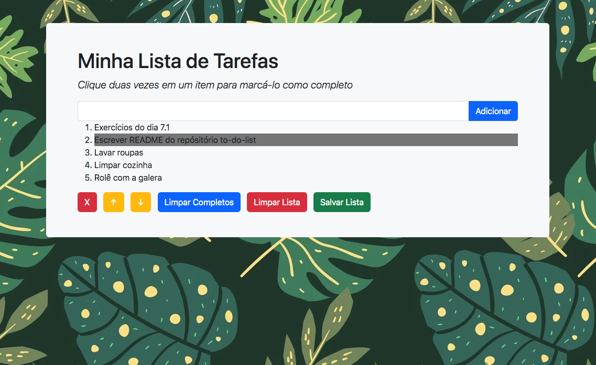

# Boas-vindas ao repositório do projeto Lista de Tarefas! 📝

## 💻 Projeto

Neste projeto, desenvolvi uma aplicação de lista de tarefas, onde a pessoa usuária pode adicionar quantas tarefas quiser, além de poder marcar tarefas como concluídas, alterar a ordem de prioridade, salvar a lista no localStorage ou apagar tudo.

Projeto referente ao módulo de fundamentos da Trybe (https://www.betrybe.com/) desenvolvido em equipe.

O resultado da aplicação pode ser acessado através da seguinte URL: [https://frantend.github.io/todo-list](https://frantend.github.io/todo-list/)

## 🎨 Layout

## 👩‍💻 Requisitos e Habilidades
Desenvolver uma página usando HTML, CSS e JavaScript. 
Estilizar a página utilizando conceitos de CSS Flexbox, Bootstrap e responsividade.
As tarefas são adicionadas dinamicamente utilizando manipulação do DOM.
Testar o código utilizando ESLint e Stylelint.
